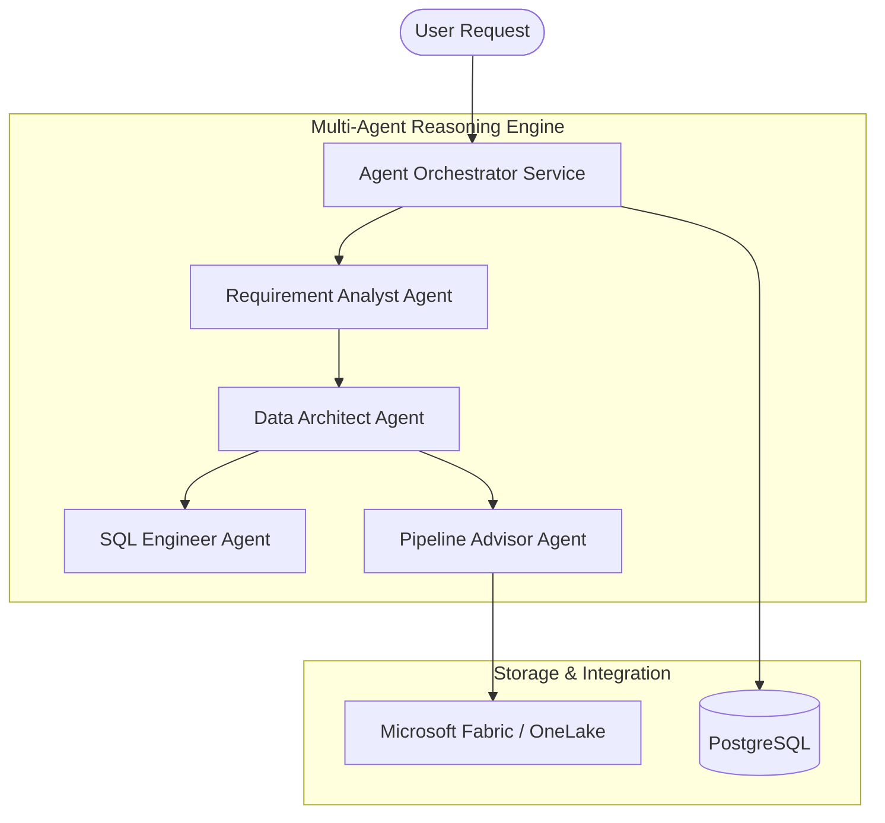

# DataPilot AI - Architecture Specification

DataPilot AI is a multi-agent workflow platform designed to convert natural language business requests into database schemas, optimized SQL queries, and Microsoft Fabric pipeline specifications.

## Component Overview

## System Layout
The system follows a clean Medallion-like data layout:
1. **Requirement Analyst Agent**: Analyzes user requirements and translates them into structured business goals, core entity definitions, target KPIs, and architectural constraints.
2. **Data Architect Agent**: Designs tables, indexes, constraints, and relationships. It outputs a normalized relational schema (Star Schema).
3. **SQL Engineer Agent**: Writes standard aggregations and advanced windowing CTE queries targeting the generated schema.
4. **Pipeline Advisor Agent**: Outlines ETL copy jobs, Synapse Notebook clean stages, and DirectLake dataset mappings to Microsoft Fabric.
